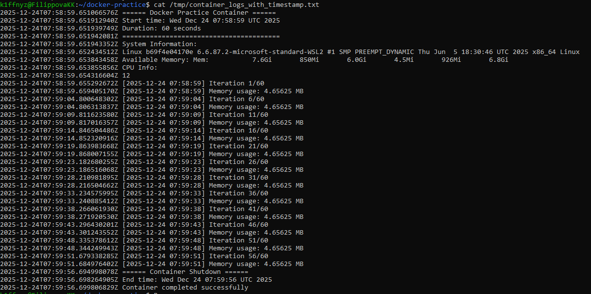
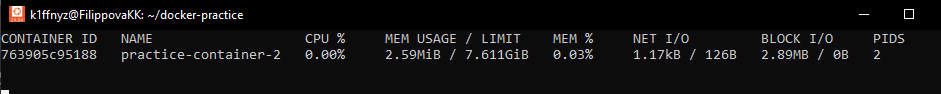
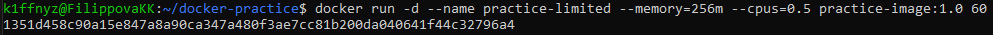
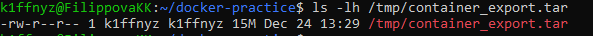
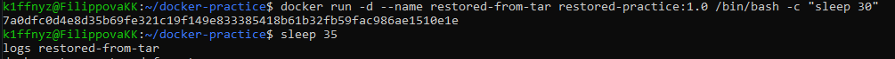

# Практическая работа: Дополнительные возможности Docker
📌 Описание
## Цель работы — изучение дополнительных возможностей Docker для управления жизненным циклом контейнеров, мониторинга их состояния и оптимизации использования системных ресурсов. В ходе работы мы рассмотрим такие аспекты, как логирование контейнеров, мониторинг их состояния, настройка ограничений по ресурсам, экспорт и импорт контейнеров.

---

## 🧩 Архитектура
* Docker — контейнеризация приложений
* Docker Logs — сбор логов контейнеров
* Docker Stats — мониторинг потребления ресурсов контейнерами
* Ограничение ресурсов — CPU и Memory для контейнеров

---

## ⚙️ Основные команды
1. Вывод логов контейнера в файл
Для сохранения логов контейнера в файл:
```yaml
docker logs <container_name> > /tmp/container_logs.txt
```

2. Проверка docker-stats
Для просмотра статистики использования ресурсов контейнером:
```yaml
docker stats <container_name>
```

3. Ограничение контейнера по CPU и Memory
Запуск контейнера с ограничением по памяти и CPU:
```yaml
docker run -d --name practice-limited --memory=256m --cpus=0.5 practice-image:1.0 60
```

4. Сохранение docker-контейнера в tar
Для экспорта контейнера в архив tar:
```yaml
docker export <container_name> > /tmp/container_export.tar
```

5. Импорт контейнера из tar
Для импорта контейнера из архива:
```yaml
docker import /tmp/container_export.tar restored-image
```

## 🚀 Запуск проекта
1. Сначала создайте директорию для проекта:
```yaml
mkdir docker-practice
cd docker-practice
```
2. Создайте Dockerfile и entrypoint.sh с содержимым, представленным в учебном материале.
3. Сборка образа:
```yaml
docker build -t practice-image:1.0 .
```

---


## 🖼️ Скриншоты

# Вывод логов контейнера в файл
Эта команда сохраняет логи контейнера в файл container_logs.txt.


# Просмотр статистики контейнера (docker stats)
Эта команда выводит информацию о текущем потреблении ресурсов контейнером.


# Запуск контейнера с ограничением ресурсов
Эта команда запускает контейнер с ограничениями по памяти (256MB) и процессорным времени (0.5 CPU).


# Экспорт контейнера в tar-архив
Эта команда экспортирует контейнер в tar-архив.


# Импорт контейнера из tar-архива
Эта команда импортирует контейнер из tar-архива.


## ✔ Статус системы

* Docker Logs: Логи контейнера успешно сохраняются в файл
* Docker Stats: Статистика контейнера успешно собирается в реальном времени
* Ограничения: Контейнеры успешно ограничиваются по CPU и памяти
* Экспорт и импорт: Контейнеры успешно экспортируются и импортируются

---

## 📋 Компоненты системы
* Docker Logs — сбор логов контейнеров
* Docker Stats — мониторинг состояния контейнеров
* Ограничения ресурсов — настройка лимитов по CPU и памяти
* Экспорт и импорт — сохранение и восстановление контейнеров в tar-формате
